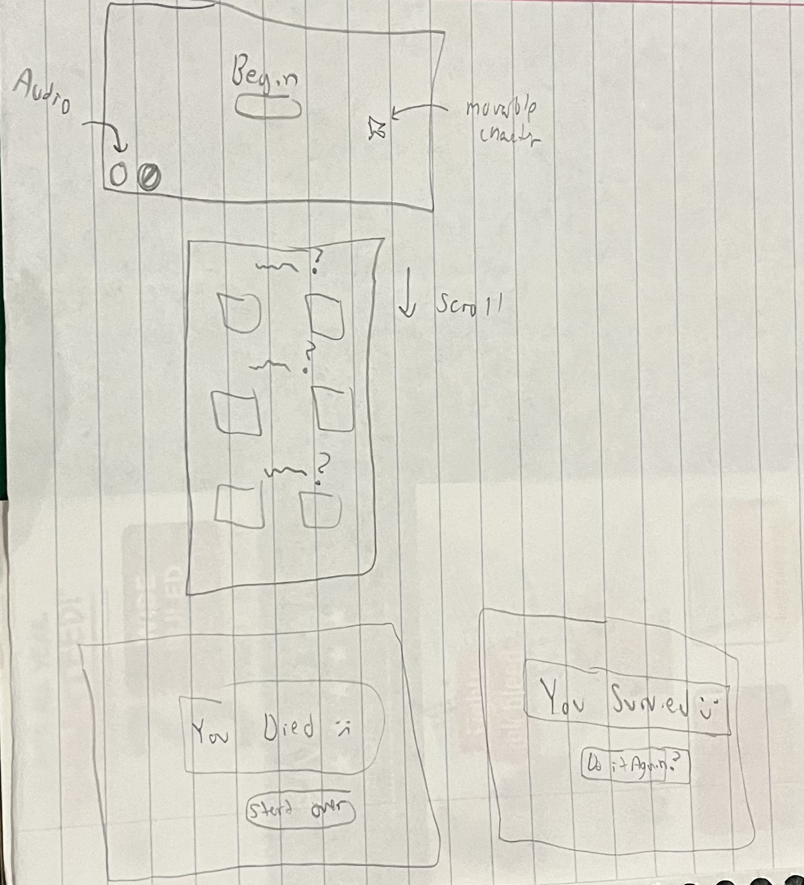
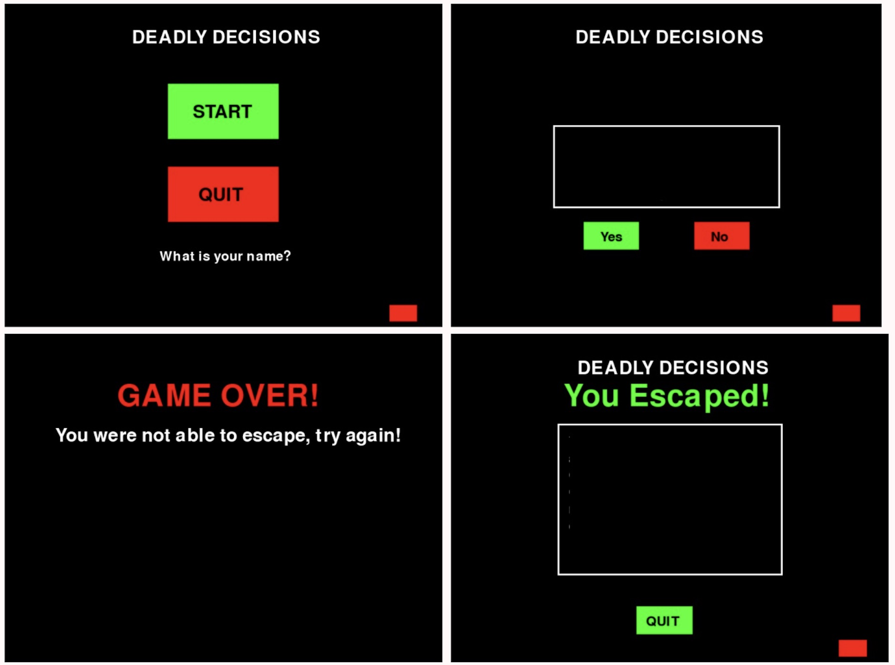

# Deadly Decisions
## CS110 Final Project, Fall Semester 2023

## Team Members
Hilary Rojas Rosales & Daniela Suqui Estrella

***

## Project Description
A scary interactive game where the player will receive a letter with a message telling them that they have stumbled across a haunted house and that they have to escape. The letter will explain the instructions and the player will then face three different scenarios, where they will make a decision (choose yer or no) in order to escape. If the player fails to make the right choice, they will get jumpscared, and lose the game but if they do make the right choice, they will continue playing until they fail or escape the haunted house.

***    

## GUI Design

### Initial Design

### Final Design

## Program Design

### Features

1. Volume Button.
2. Menu Options (Start Game and Quit Game).
4. Option to have the player's name displayed throughout the game.
5. A letter with instructions and three different scenarios for the player.
6. Yes or No Buttons that give the player two different outcomes.
7. Images and jumpscare sounds.
8. A "Game Over" and "You Survived" screen.

### Classes

1. GameState - Defines different states of the game: MAIN_MENU, NAME_INPUT, GAMEPLAY. 

## ATP
| Case #   | Description | Steps | Outcome |
| -------- | ----------- | ----- | ------- |
| Test Case 1: Menu Navigation | Verify player can start and quit the game. |  Navigate through the main menu, and confirm that the start button starts the game, and that the quit button quits the game or closes the window.| The main menu should allow the player to start and quit the game when they press the start/quit button. |
| Test Case 2: Volume Button | Verify Player can turn music on and off. | 1. start game. 2. Go to bottom right corner on menu where red button is. 3. Click to turn music off. 4. Click once more to turn music on.| Players' control over sounds. |
| Test Case 3: Name Check | Verify that the player can input their name. | Once the player clicks the start button and then clicks the box that appears. The player will be prompted to input their name which will be later on used during the game. The player should be able to write their name. | The player’s name should be displayed throughout the game. |
| Test Case 4: Jump scare | Verify that when player loses or picks the wrong choice in one of the scenarios, an image pops up. | Start game, and when an scenario appears, they will have to pick yes or no. If they pick the wrong choice, they will be jumpscared.| A jump scare with sound. |
| Test Case 5: Game Over Condition | Verify that the game ends once the player makes the wrong decision. | When the player is asked to choose between the choices given, if they choose the wrong one, a “Gave Over” message should be displayed. After the message is displayed, the game will quit and they will have to start the game over again. | The game will display a “Game Over” message when the player makes the wrong choice, and quit the game. |

